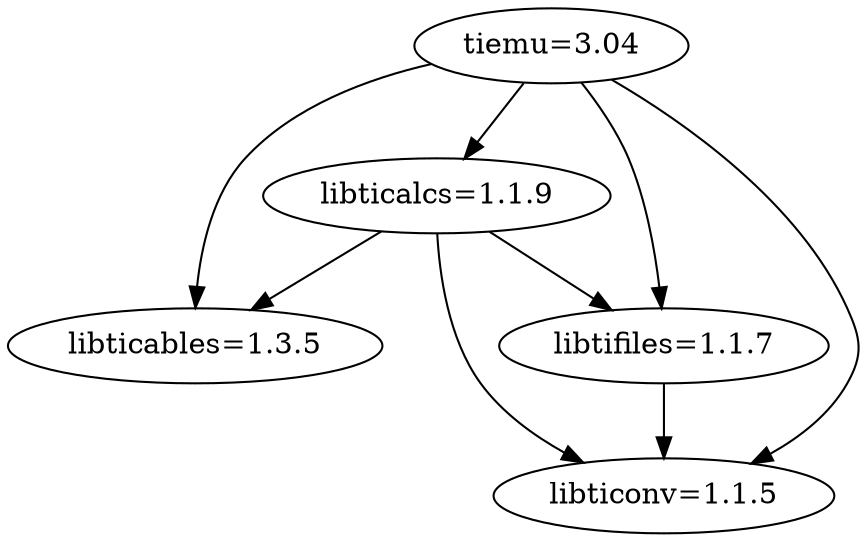

# tiemu

This repository is a fork of [science-team/tiemu](https://salsa.debian.org/science-team/tiemu), which contains the sources of the currently maintained [Debian tiemu package](https://packages.debian.org/buster/tiemu), which is based on [debrouxl/tiemu](https://github.com/debrouxl/tiemu/tree/12284cfc461f325848d0405b5a95fdbd6bba0f8b/tiemu/trunk).

This fork has been created to address a known issue with tiemu running on a Linux environment: Keyboard arrows keys inputs are not mapped correctly, as discussed in the following links:

* [Arrows keys don't work under Linux](https://sourceforge.net/p/gtktiemu/bugs/87)
* [Keyboard layout under Linux](https://sourceforge.net/p/gtktiemu/bugs/66)
* [Incorrect keyboard mapping](https://bugs.launchpad.net/ubuntu/+source/tiemu/+bug/373767)
* [tiemu: arrows key right, left, ... not working and geometry cannot be called at start](https://bugs.debian.org/cgi-bin/bugreport.cgi?bug=610554)
* ["TIEmu does apparently not play with modern evdev based keyboard input methods due to hardcoded scancodes"](https://aur.archlinux.org/packages/tiemu/#comment-640644)
* ["Fixes broken keyboard mappings"](https://github.com/wyatt8740/tiemu3-linux-fixes)

## Cause

tiemu reads keyboard inputs:

* By declaring a `key_press_event` listener named `on_calc_wnd_key_press_event` in: https://salsa.debian.org/science-team/tiemu/blob/debian/3.04_git20110801-nogdb+dfsg1-2/glade/calc-2.glade#L24
* Which calls `hwkey_to_tikey()` with a `(GdkEventKey event)->hardware_keycode` in: https://salsa.debian.org/science-team/tiemu/blob/debian/3.04_git20110801-nogdb+dfsg1-2/src/gui/calc/keyboard.c#L275
* Which tries to map the received GDK hardware keycode to a `Pc2TiKey.ti_key`, by looking for a matching `Pc2TiKey.pc_key` in `Pc2TiKey* kbd_keymap` in: https://salsa.debian.org/science-team/tiemu/blob/debian/3.04_git20110801-nogdb+dfsg1-2/src/gui/calc/keyboard.c#L62

This `Pc2TiKey* kbd_keymap` is loaded:

* By `keymap_load()` in: https://salsa.debian.org/science-team/tiemu/blob/debian/3.04_git20110801-nogdb+dfsg1-2/src/gui/calc/keymap.c#L108
* Which calls `keymap_string_to_value(pckeys, split[0])` to convert PC key names read from a keymap file (e.g. https://salsa.debian.org/science-team/tiemu/blob/debian/3.04_git20110801-nogdb+dfsg1-2/skins/ti89.map#L62) to keycodes in: https://salsa.debian.org/science-team/tiemu/blob/debian/3.04_git20110801-nogdb+dfsg1-2/src/gui/calc/keymap.c#L174
* With `pckeys` declared in: https://salsa.debian.org/science-team/tiemu/blob/debian/3.04_git20110801-nogdb+dfsg1-2/src/gui/calc/keynames.c#L128
* Which relies on `PCKEY_*` macro constants defined in: https://salsa.debian.org/science-team/tiemu/blob/debian/3.04_git20110801-nogdb+dfsg1-2/src/gui/calc/pckeys.h#L185

The root cause of this problem is that the hardcoded `PCKEY_*` macro constants values, which cannot be modified after the build, are incorrect.

This is because, according to https://www.berrange.com/tags/key-codes, GDK hardware keycodes are not easily interpreted on X11 because their values can vary depending on the current keyboard driver used by X11.

## Proposed resolution

The idea of this patch is to avoid handling GDK hardware keycodes and use GDK keysyms instead.

Furthermore, to simplify the code, the idea is to also to let users directly use GDK keysyms in the keymap file.

Thus, the [ti89.map](skins/ti89.map) file is being changed from:

```
PCKEY_UP:TIKEY_UP
PCKEY_DOWN:TIKEY_DOWN
PCKEY_RIGHT:TIKEY_RIGHT
PCKEY_LEFT:TIKEY_LEFT
```

To:

```
GDK_Up:TIKEY_UP
GDK_Down:TIKEY_DOWN
GDK_Right:TIKEY_RIGHT
GDK_Left:TIKEY_LEFT
```

Please note that, because GTK+ 2.6 is listed as a requirement for tiemu in https://salsa.debian.org/science-team/tiemu/blob/debian/3.04_git20110801-nogdb+dfsg1-2/README.linux#L13, the proposed patch exclusively includes the GDK keysyms listed in https://gitlab.gnome.org/GNOME/gtk/blob/GTK_2_6_0/gdk/gdkkeysyms.h.

This patch has been manually tested on Ubuntu 18.04.3 with GTK 2.24.32-1ubuntu1 with a French keyboard layout.

## Bonus: Build instructions

On Ubuntu 18.04.3, tiemu can be build using the following instructions:

```shell
$ git clone https://salsa.debian.org/science-team/libticables.git libticables/libticables
$ (cd libticables/libticables ; dpkg-buildpackage -rfakeroot -b -uc -us)
$ sudo dpkg -i libticables/libticables*.deb

$ git clone https://salsa.debian.org/science-team/libticonv.git libticonv/libticonv
$ (cd libticonv/libticonv ; dpkg-buildpackage -rfakeroot -b -uc -us)
$ sudo dpkg -i libticonv/libticonv*.deb

$ git clone https://salsa.debian.org/science-team/libtifiles.git libtifiles/libtifiles
$ (cd libtifiles/libtifiles ; dpkg-buildpackage -rfakeroot -b -uc -us)
$ sudo dpkg -i libtifiles/libtifiles*.deb

$ git clone https://salsa.debian.org/science-team/libticalcs.git libticalcs/libticalcs
$ (cd libticalcs/libticalcs ; dpkg-buildpackage -rfakeroot -b -uc -us)
$ sudo dpkg -i libticalcs/libticalcs*.deb

$ git clone https://salsa.debian.org/science-team/tiemu.git tiemu/tiemu
$ (cd tiemu/tiemu ; dpkg-buildpackage -rfakeroot -b -uc -us)
$ sudo dpkg -i tiemu/tiemu*.deb
```

As the dependency graph between the dependencies of tiemu is as follows:


